<div align="center">
  <h1> 📊 Exploratory Data Analysis (EDA) Lab</h1>
  </div>
A hands-on EDA lab that walks through data cleaning, feature exploration, statistical diagnostics, and quick modeling on:

- **Regression**: Diabetes dataset `(scikit-learn)`
- **Classification**: Iris dataset `(scikit-learn)`

The notebook demonstrates how EDA directly informs modeling choices (e.g., handling missing values, transforming features, removing outliers) and quantifies their effects on predictive performance.


<div align="center">
  
</div>

---

## 🎯 Objectives

- Perform **practical EDA** using a compact set of Python commands and visualizations  
- **Diagnose** data issues (missingness, non-normality, outliers) and apply fixes  
- **Compare modeling outcomes** after each EDA-driven change  
- Practice **feature engineering** and **preprocessing** for ML readiness  

---

## 🧰 Technologies & Libraries

- **Python 3.10+**, **Jupyter Notebook**
- **Core**: `numpy`, `pandas`
- **Visualization**: `matplotlib`, `seaborn`, `missingno`
- **ML & Stats**: `scikit-learn`, `scipy`
- **EDA utility**: `fasteda`

> The notebook includes an install cell that pins some versions (e.g., `scikit-learn==1.4.1.post1`, `seaborn==0.13.2`, `fasteda==1.0.1`) for reproducibility.

---

## 🗂️ What’s Inside

- **Regression (Diabetes)**
  - Load dataset, quick glance (`head`/`tail`), summary stats (`describe`)
  - **Inject controlled missingness** (10% of rows for 3 random feature columns) to simulate real-world data issues
  - Visualize missingness with **missingno** (bar & matrix)
  - One-hot encoding (example: `sex`)
  - Distribution analysis (histograms/boxplots), normality checks (Shapiro-Wilk)
  - Correlation heatmap, pairplots
  - **Baseline and iterative linear regression experiments** with different preprocessing choices
- **Classification (Iris)**
  - Dataset overview, class balance check (exact counts & pie chart)
  - Basic EDA (distributions, pairplots) to assess class separability

---

## 🔬 Key Experiments & Results (Diabetes Regression)

Below is a step-by-step record of what was tried and what changed—grounded in the notebook’s computed metrics:

### 1) Baseline: Drop rows with missing values
- **Setup**: Remove any row that contains a missing value; fit Linear Regression on remaining rows  
- **Result**: **RMSE = 56.0268**

> Takeaway: Simple row-dropping reduces sample size and hurt performance relative to later strategies.

### 2) Impute Missing Values (Median)
- **Setup**: `SimpleImputer(strategy='median')` on all features; Linear Regression  
- **Result**: **RMSE = 55.7343**  
- **Comparison vs. Baseline**: Improved (lower RMSE)

> Takeaway: Median imputation restores data without discarding rows and performs better than dropping rows.

### 3) Median Imputation **+ log-transform `s3`**
- **Normality Diagnostics (Shapiro-Wilk)**:
  - Raw `s3`: **W = 0.962, p = 0.000** → *reject normality*
  - `log(s3)`: **W = 0.996, p = 0.700** → *looks normal* (fail to reject H0)
- **Setup**: Apply `log(s3)`, then median impute; Linear Regression  
- **Result**: **RMSE = 55.5418**  
- **Comparison vs. #2**: Better (transformation improved fit)

> Takeaway: EDA revealed non-normal `s3`; log-transform normalized it and slightly improved model accuracy.

### 4) Median Imputation + `log(s3)` **+ Outlier Removal in `s2`**
- **Setup**: Remove extreme outlier(s) in `s2` (keep observations with `s2 < 99.9th percentile`), then median impute; Linear Regression  
- **Result**: **RMSE = 55.3666**  
- **Comparison vs. #3**: Best so far

> Takeaway: Targeted outlier trimming (guided by EDA) yielded another small but meaningful gain.

### 5) Median Imputation + `log(s3)` + `s2` Outlier Removal **+ Drop `s1`**
- **Setup**: Same as #4 plus dropping feature `s1`; Linear Regression  
- **Result**: **RMSE = 55.3917**  
- **Comparison vs. #4**: Slightly worse

> Takeaway: Dropping `s1` did **not** help; the best configuration kept `s1`.

### 📈 Summary Table (RMSE ↓ is better)

| Experiment | Preprocessing Summary | RMSE |
|---|---|---|
| #1 | Drop rows with any missing values | **56.0268** |
| #2 | Median imputation | **55.7343** |
| #3 | Median imputation + `log(s3)` | **55.5418** |
| #4 | Median imputation + `log(s3)` + remove `s2` outlier (99.9%) | **55.3666** ✅ *Best* |
| #5 | #4 + drop `s1` | **55.3917** |

**Overall conclusion:**  
EDA-driven adjustments (normalizing `s3`, trimming `s2` outliers) **consistently lowered RMSE** versus naive missing-data handling. The **best setup** combined log-transform of `s3` with selective `s2` outlier removal (retain `s1`).

---

## 🌸 Classification (Iris) – EDA Highlights

- **Class balance**: The dataset is perfectly balanced  
  - `setosa`: 50, `versicolor`: 50, `virginica`: 50
- Visual EDA (histograms/pairplots) highlights **clear class separability** along **petal length** and **petal width**, a common and instructive pattern in Iris.

> This section focuses on EDA; you can extend it by training a quick classifier and reporting metrics (accuracy, precision/recall, confusion matrix).

---

## 🧪 Statistical Diagnostics

- **Shapiro-Wilk normality tests** (key example `s3` → `log(s3)`):
  - Raw `s3`: **W = 0.962, p = 0.000** → not normal  
  - `log(s3)`: **W = 0.996, p = 0.700** → looks normal  
- Interpretation: **Log-transforming a skewed feature** improved normality and helped the linear model.

---

## 🖼️ Visuals Produced

- Missingness bar/matrix (**missingno**)
  <div align="center">
  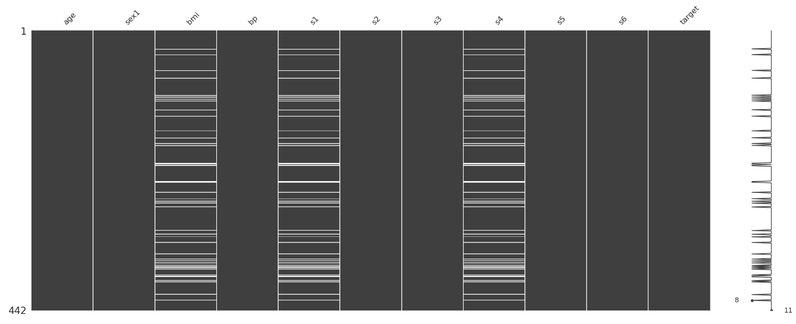
</div>

- Histograms & boxplots for distribution/outliers
  <div align="center">
  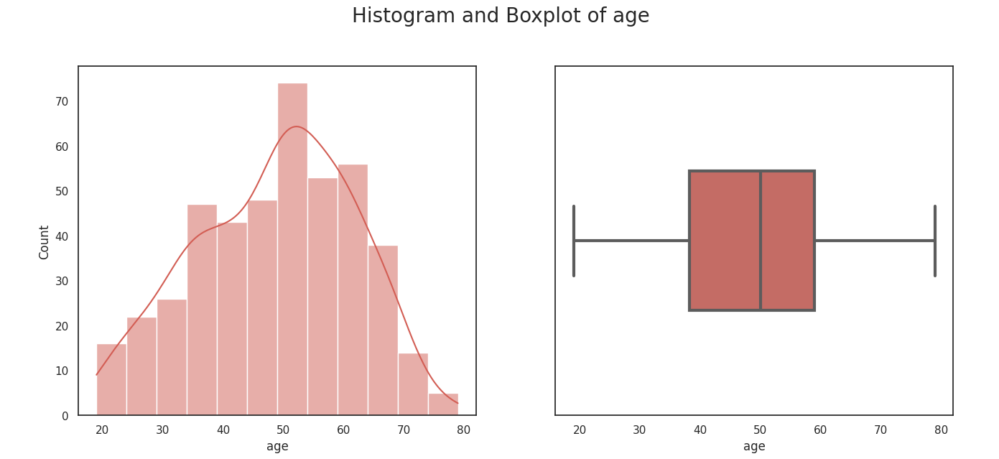
  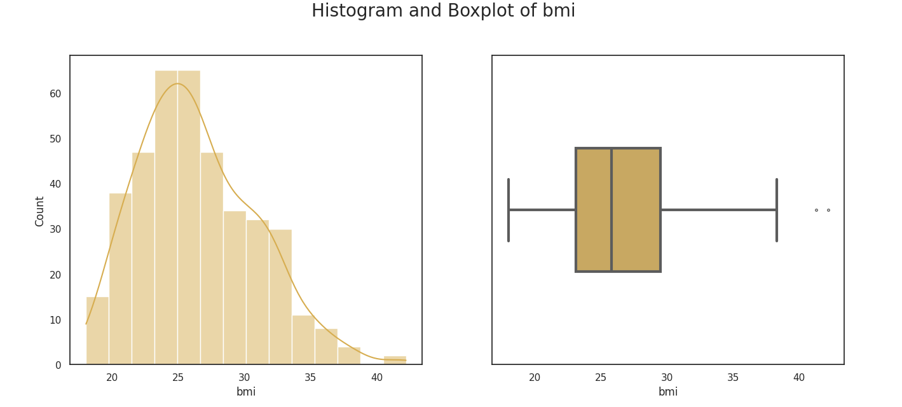
  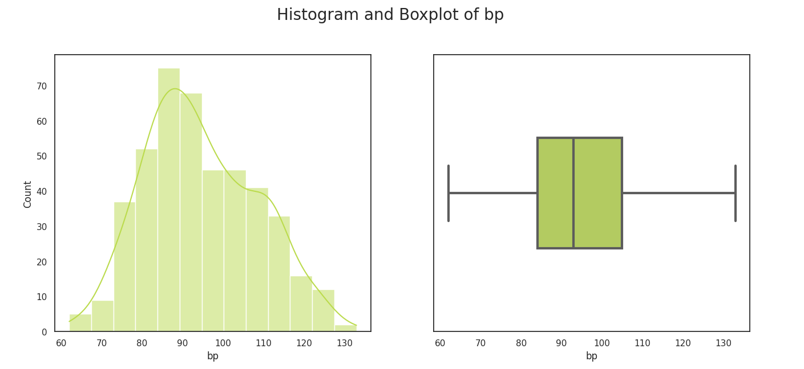
  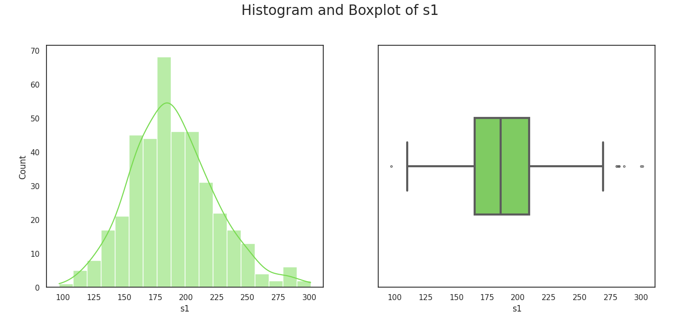
  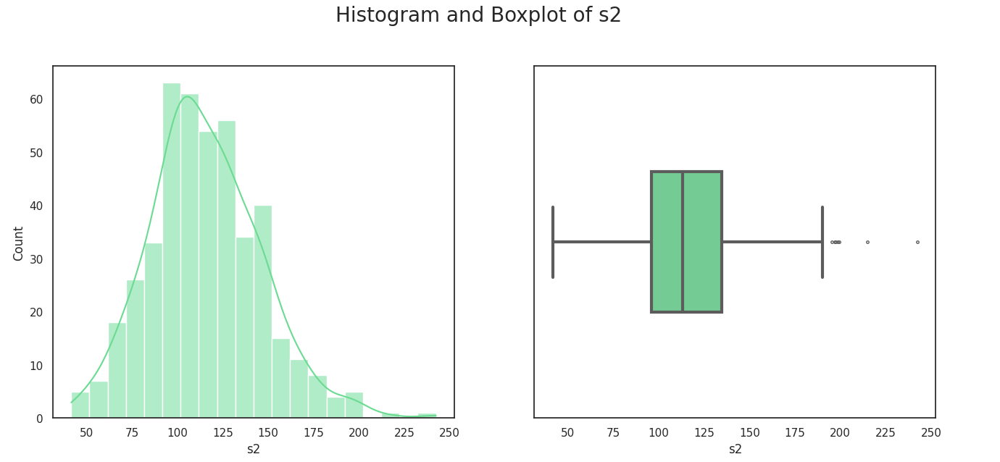
  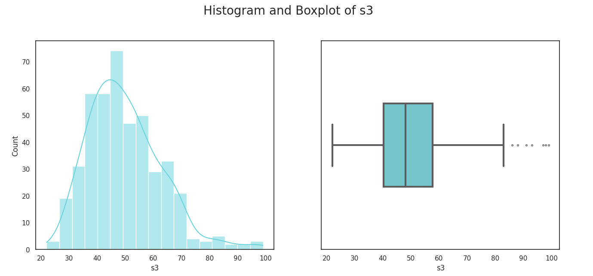
  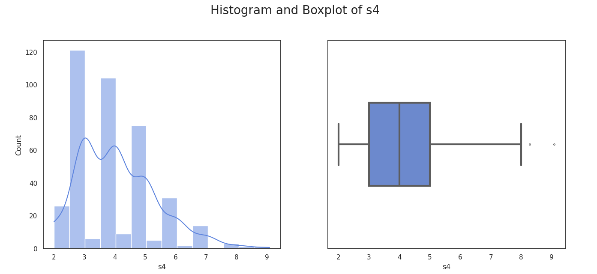
  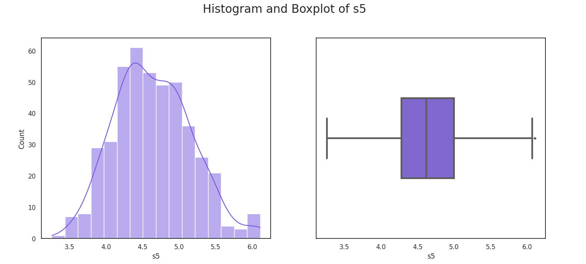
  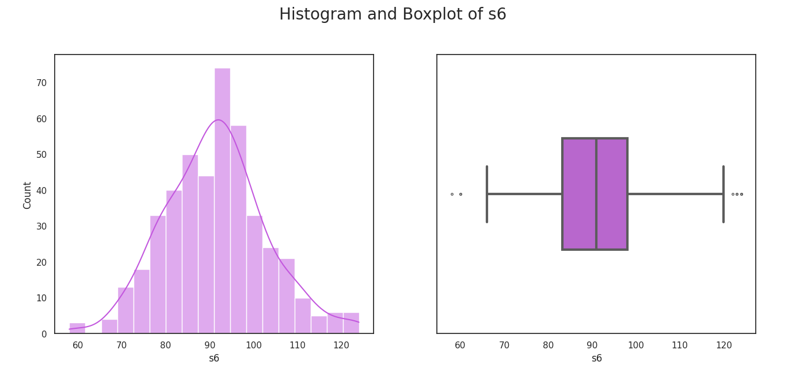
  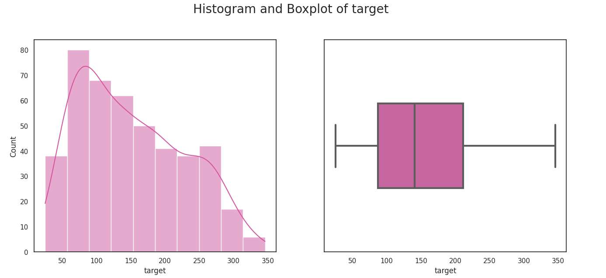
</div>

- Correlation heatmap (feature relationships)
  <div align="center">
  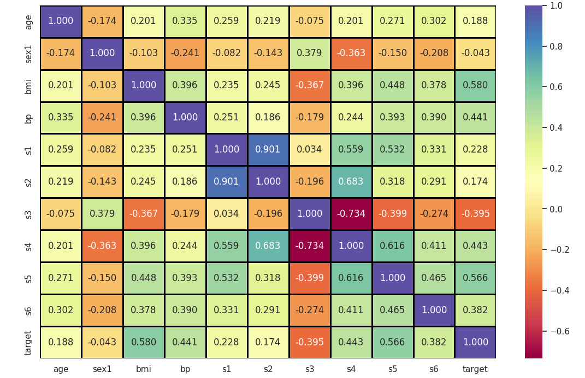
</div>

- Pairplots (multi-feature interaction)
  <div align="center">
  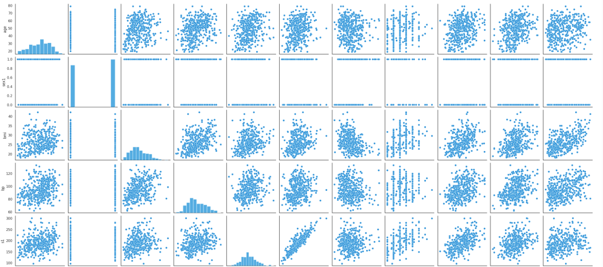
  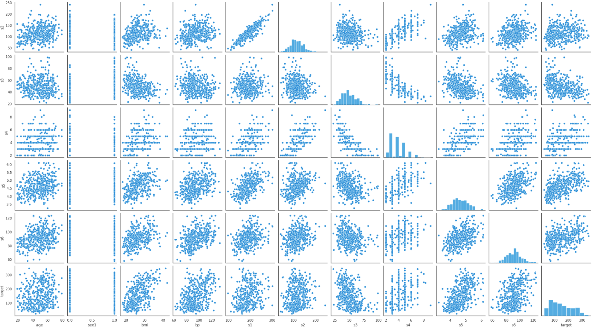
</div>

- Pie chart (Iris class balance)
  <div align="center">
  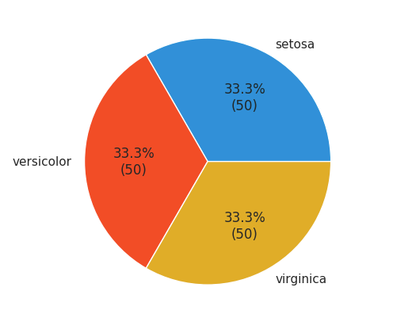
</div>
> These figures are generated inside the notebook.

---

## ✅ Key Takeaways

- Don’t drop rows blindly: Simple row removal for missing data worsened performance.
- Impute, then improve: Median imputation helped; transformations (e.g., log(s3)) and outlier handling (e.g., s2) helped even more.
- Keep useful features: Removing s1 did not improve performance in this setup.
- **EDA → Modeling wins**: Diagnostics (normality tests, missingness plots) directly informed choices that lowered RMSE.

---
## 🙌 Acknowledgments

**Datasets**: `scikit-learn` **(Diabetes, Iris)**

**EDA helpers**: `missingno`, `fasteda`

---
## 🚀 How to Run

```bash
# 1) Clone the repo
git clone https://github.com/<your-username>/<your-repo>.git
cd <your-repo>

# 2) (Optional) Create a virtual environment
python -m venv venv
# Windows: .\venv\Scripts\activate
# macOS/Linux:
source venv/bin/activate

# 3) Install dependencies
# If you add requirements.txt, then:
pip install -r requirements.txt
# Or install manually:
pip install numpy pandas matplotlib seaborn missingno scikit-learn scipy fasteda jupyterlab

# 4) Launch Jupyter
jupyter lab
# Open EDA_lab.ipynb and run all cells
```

## 👨‍💻 Author
<div style="display: flex; align-items: center; gap: 20px">  <div> <strong>Shyam Sundar Vijayakumar</strong><br> Data Scientist | Programmer | AI Enthusiast </div> </div>

---

## 📜 License
This project is licensed under the MIT License.
Shared for educational and portfolio purposes. Attribution is appreciated.

